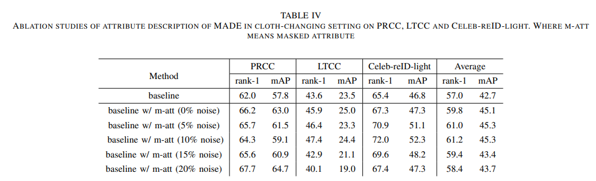

# Masked Attribute Description Embedding for Cloth-Changing Person Re-identification.
The *official* repository for  [Masked Attribute Description Embedding for Cloth-Changing Person Re-identification](http://arxiv.org/abs/2401.05646).

## Pipeline


## Ablation Study of MADE




#### Requirements
- Python 3.7
- Pytorch 1.13.1
- yacs
- timm
- spacy

### Prepare Datasets


Download the cloth-changing person Re-ID datasets, [PRCC](http://www.isee-ai.cn/%7Eyangqize/clothing.html), [LTCC](https://naiq.github.io/LTCC_Perosn_ReID.html), [Celeb-reID-light](https://github.com/Huang-3/Celeb-reID) and [LaST](https://github.com/shuxjweb/last.git). Then add attributes file(get from [SOLIDER](/data/PycharmProjects/MADE/SOLIDER/README.md)) in each dataset file. 


```
Data
├── PRCC
│   └── rgb ..
│   └── sketch ..
│   └── PAR_PETA_105.txt 
├── LTCC
│   └── train ..
│   └── query ..
│   └── test ..
│   └── PAR_PETA_105.txt 
├── Celeb-reID-light
│   └── train ..
│   └── query ..
│   └── gallery ..
│   └── PAR_PETA_105.txt 
├── LaST
│   └── train ..
│   └── val ..
│   └── test ..
│   └── PAR_PETA_105.txt 
```

## Training

We utilize 2 GPUs for training. Replace `_C.DATA.ROOT` in `config/defaults.py`with your own `data path`.

```bash
CUDA_VISIBLE_DEVICES=0,1 python -m torch.distributed.launch --nproc_per_node=2 --master_port 6666 train.py --config_file ${1} DATA.ADD_META ${2} DATA.MASK_META ${3} MODEL.DIST_TRAIN True
```

#### Arguments

- `${1}`: config file path.
- `${2}`: whether adding attributes.
- `${3}`: whether masking clothing-relevant attribute.

**or you can directly train with following  yml and commands:**

```bash
# prcc
CUDA_VISIBLE_DEVICES=0,1 python -m torch.distributed.launch --nproc_per_node=2 --master_port 6666 train.py --config_file configs/prcc/eva02_l_maskmeta_random.yml MODEL.DIST_TRAIN True
# ltcc
CUDA_VISIBLE_DEVICES=0,1 python -m torch.distributed.launch --nproc_per_node=2 --master_port 6666 train.py --config_file configs/ltcc/eva02_l_maskmeta_random.yml MODEL.DIST_TRAIN True
# Celeb_reID_light
CUDA_VISIBLE_DEVICES=0,1 python -m torch.distributed.launch --nproc_per_node=2 --master_port 6666 train.py --config_file configs/Celeb_light/eva02_l_maskmeta_random.yml MODEL.DIST_TRAIN True
# last
CUDA_VISIBLE_DEVICES=0,1 python -m torch.distributed.launch --nproc_per_node=2 --master_port 6666 train.py --config_file configs/last/eva02_l_maskmeta_random.yml MODEL.DIST_TRAIN True
```


## Evaluation

```bash
CUDA_VISIBLE_DEVICES=1,0 python -m torch.distributed.launch --nproc_per_node=2 --master_port 6666 test.py --config_file 'choose which config to test' TEST.WEIGHT "('your path of trained checkpoints')"
```

**example:**

```bash
# LTCC
CUDA_VISIBLE_DEVICES=1,0 python -m torch.distributed.launch --nproc_per_node=2 --master_port 6666 test.py --config_file configs/ltcc/eva02_l_maskmeta_random.yml TEST.WEIGHT '../logs/ltcc/eva02_l_meta_best.pth'
```


## Acknowledgement

Codebase from [TransReid](https://github.com/damo-cv/transreid) , [CAL](https://github.com/guxinqian/Simple-CCReID)

## Citation

If you find this code useful for your research, please cite our paper:

```
@misc{peng2024masked,
      title={Masked Attribute Description Embedding for Cloth-Changing Person Re-identification}, 
      author={Chunlei Peng and Boyu Wang and Decheng Liu and Nannan Wang and Ruimin Hu and Xinbo Gao},
      year={2024},
      eprint={2401.05646},
      archivePrefix={arXiv},
      primaryClass={cs.CV}
}
```

